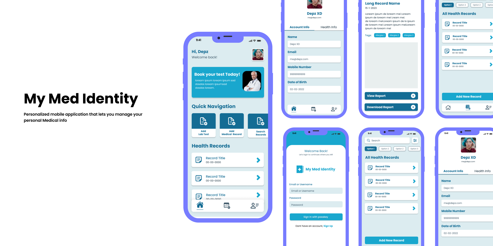

# My Med Identity

My Med Identity is a personilized Mobile app that lets you store and manage your personal medical Records.

<div align="center">
  
</div>

## Run Locally

[**Setup Backend 🔗**](https://github.com/itsdevdeepak/my-med-identity-backend)
<br>

Clone the project

```bash
  git clone https://github.com/itsdevdeepak/my-med-identity
```

Go to the project directory

```bash
  cd my-med-identity
```

Install dependencies

```bash
  npm install
```

Start the server

```bash
  npm start
```

## Screenshots


